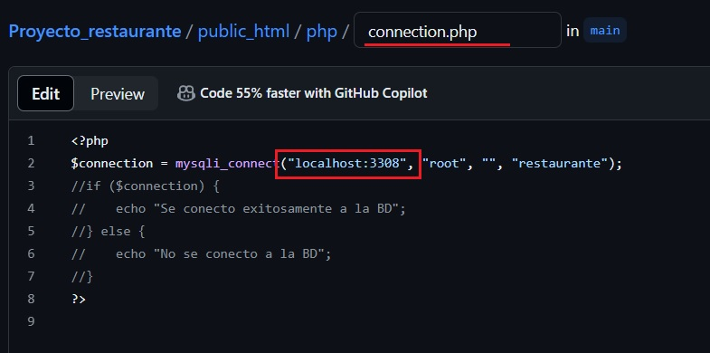

## Primera Actualizacion
- Se requiere de una base de datos local en phpmyadmi llamada restaurante para poder ejecutar el proyecto y la tabla clientes para la lectura de los usuarios
```sql
CREATE DATABASE restaurante;
CREATE TABLE clientes(
  id INT PRIMARY KEY AUTO_INCREMENT,
  nombre_completo VARCHAR(50),
  correo VARCHAR(50),
  usuario VARCHAR(150),
  constrasena VARCHAR(150)
);
```

